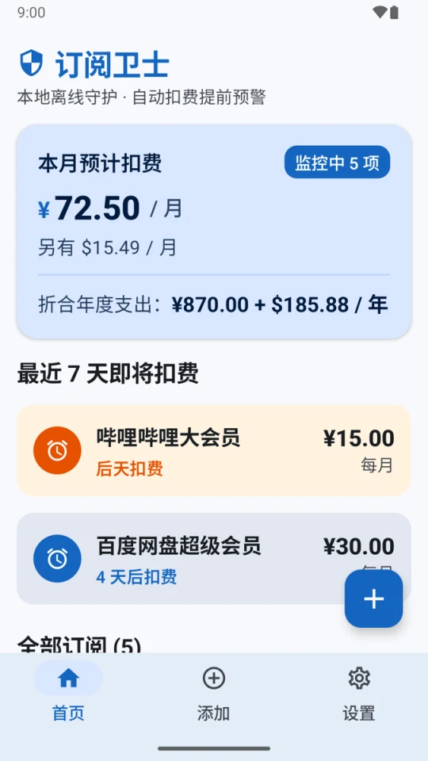
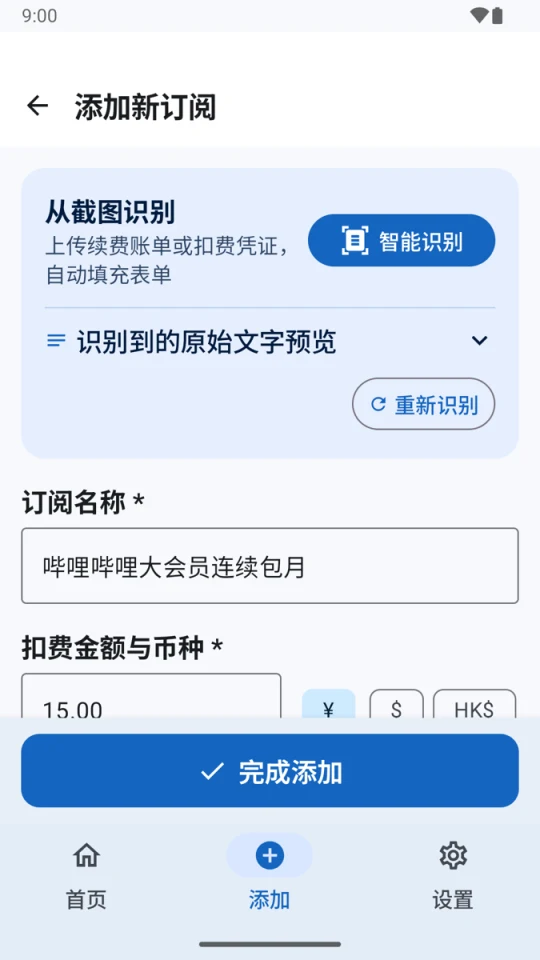
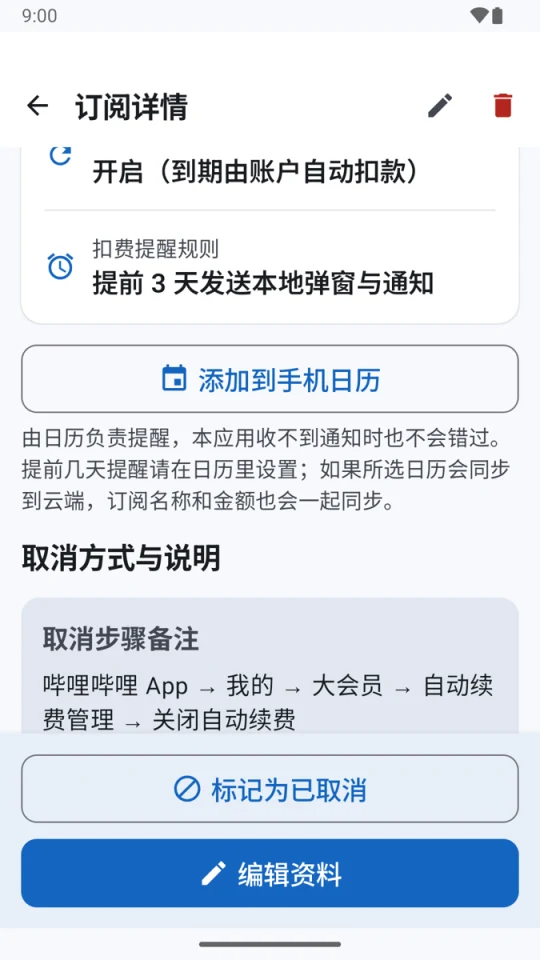
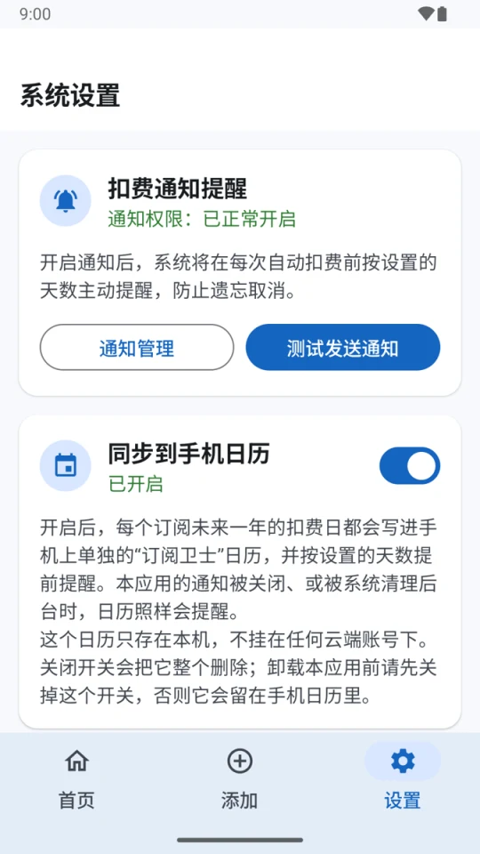

# 订阅卫士 SubGuard

中文 | [English](README.en.md) | [介绍页](https://ike-li.github.io/subscription-charge-guardian/)

**订阅卫士是一款开源、完全离线的 Android 自动续费订阅管理应用：记下你开通的会员和订阅，在每次扣费前提醒你，帮你及时取消不想再续费的服务。** 它不申请网络权限，数据只存在手机上；可以从扣费截图里自动识别订阅信息，也可以把扣费日写进手机日历。界面字号偏大，照顾中老年用户。

<table>
  <tr>
    <td></td>
    <td></td>
    <td></td>
    <td></td>
  </tr>
  <tr>
    <td align="center">首页总览</td>
    <td align="center">截图识别</td>
    <td align="center">详情与取消步骤</td>
    <td align="center">通知与日历提醒</td>
  </tr>
</table>

## 功能

- **记录订阅**：名称、金额（人民币 / 美元 / 港币）、每月 / 每季 / 每年、下次扣费日期，还可以记下取消链接和取消步骤。
- **首页总览**：本月和全年预计扣费（按币种分别合计，不做汇率换算），最近 7 天要扣费的订阅，以及全部订阅。长按某个订阅可以删除。
- **扣费提醒**：在扣费前 1 / 3 / 7 / 14 天发本地通知，点通知直接进入这条订阅的详情。开着自动续费的订阅，扣费日一过会自动顺延到下一期。
- **写进手机日历**：通知被关掉、或 App 被系统清理后台时，还可以靠日历提醒。详情页的“添加到手机日历”会打开日历 App 并预填好这次扣费，不需要任何权限；设置页打开“同步到手机日历”后，所有订阅未来一年的扣费日会自动写进一个单独的“订阅卫士”日历，并按设置的天数提前提醒。
- **截图识别**：从相册选图或直接拍照，在本地识别文字并自动填表。识别不准时，名称、金额、日期下面会列出候选值，点一下就能换。用户已经填好的内容不会被识别结果覆盖。
- **大字号**：正文不小于 16sp，标题不小于 20sp。

## 适用手机

| 能用 | 不能用 |
|---|---|
| Android 7.0 及以上、ARM 处理器的手机。小米 / 红米、OPPO / 一加 / realme、vivo / iQOO、荣耀、三星、Pixel 等都基于 Android，满足这两个条件就能安装 | Android 6.0 及以前的手机 |
| 没有 Google 服务的手机（国行机型常见） | 华为 HarmonyOS NEXT（HarmonyOS 5 及以后，俗称“纯血鸿蒙”）：这个系统不能安装任何 APK |
| 华为 HarmonyOS 4 及以前的版本 | x86 处理器的设备（主要是电脑上的安卓模拟器） |

## 常见问题

### 订阅卫士需要联网吗？会不会上传我的数据？

不需要联网，也不会上传。App 没有申请 `INTERNET` 权限，技术上就连不了网；订阅数据只保存在手机本地数据库里，并且关闭了系统云备份。截图识别用的是打包在安装包里的 Google ML Kit 离线模型，识别过程也在手机上完成。

### 它能帮我自动取消订阅吗？

不能。订阅卫士只负责记录和提醒，取消需要你到对应的平台操作。每条订阅都可以记下取消链接和取消步骤，收到提醒后照着做就行。

### 为什么扣费提醒没有准时弹出来？

小米、华为、OPPO、vivo 等系统会限制后台任务，可能让通知推迟或被拦截。建议在系统设置里把订阅卫士的省电策略设为“无限制”并允许自启动（App 设置页有入口）；也可以打开“同步到手机日历”，由系统日历负责提醒。

### 没有 Google 服务的手机能用吗？

能。截图识别的模型打包在安装包里，不依赖 Google Play 服务。在没有任何 Google 组件的 Android 14 模拟器上测试过，截图识别、扣费通知、写入手机日历都正常。

### 华为鸿蒙手机能用吗？

HarmonyOS 4 及以前的版本可以安装使用。HarmonyOS NEXT（HarmonyOS 5 及以后）去掉了安卓运行环境，不能安装任何 APK，所以不能使用。

### 截图识别支持哪些页面？

目前用 Google Play 订阅页的真实截图和构造的微信扣费凭证样例调校过，能识别名称、金额、币种、周期和下次扣费日期。支付宝、App Store 等页面还没有专门验证，识别不准时可以从候选值里点选，或者手动修改。

### 支持哪些币种？不同币种怎么合计？

支持人民币、美元和港币。App 不联网拿不到汇率，所以不同币种分别合计，不做换算。

### 同步到手机日历会把数据传到云端吗？

自动同步只写入一个挂在本机账号下的“订阅卫士”日历，它不属于任何云端账号。详情页的“添加到手机日历”则由你在日历 App 里选择存到哪个日历；如果选的是小米账号、Google 账号等会同步到云端的日历，订阅名称和金额也会一起上传。

### 怎么安装和更新？

从 [Releases](https://github.com/Ike-li/subscription-charge-guardian/releases) 页面下载 APK 安装。App 不联网，不会自己检查更新：可以在 GitHub 上关注本仓库的 Releases（Watch → Custom → Releases），或者用 Obtainium 之类的工具跟踪。新版本直接覆盖安装，数据会保留。

### 怎么确认下载的安装包没有被篡改？

所有安装包都用同一个签名证书签名，证书的 SHA-256 指纹是：

```
b4f99528a9c2bd045058116a99b7e72bc8dfd11985cc3d74d2bcbaeb4e7ead8d
```

可以用 Android SDK 里的 `apksigner verify --print-certs 安装包.apk` 核对。

### 订阅卫士免费吗？

免费，并且开源，使用 MIT 许可证。

## 隐私

- 不申请 `INTERNET` 权限，任何数据都不会发出去。
- 数据存放在手机本地数据库里，并且关闭了系统云备份。没有账号，也没有统计。
- 日历权限只在打开“同步到手机日历”时申请。App 只写自己建的“订阅卫士”日历，这个日历挂在本机账号下，不属于任何云端账号。卸载 App 不会删除它，卸载前请先关掉这个开关。
- 用“添加到手机日历”时，事件存进你在日历 App 里选的那个日历。如果那个日历会同步到云端，订阅名称和金额也会一起上传。
- 文字识别使用 Google ML Kit。它是闭源 SDK，识别模型直接打包在 APK 里，离线运行。

## 安装

安装包见 [Releases](https://github.com/Ike-li/subscription-charge-guardian/releases) 页面，大小约 11MB；如果还没有发布，可以按下面的步骤自行构建。

- 需要 Android 7.0 及以上。只打包了 ARM 架构，x86 模拟器装不上。
- 从浏览器下载的 APK 需要允许“安装未知应用”，部分手机还会弹出安全提示；华为手机需要先关闭“纯净模式”。
- 在小米等国产系统上，为了让提醒准时，建议把这个 App 的省电策略设为“无限制”，并允许自启动。App 的设置页里也有相应入口。

## 构建

需要 JDK 17–21，以及装有 platform `android-36.1` 的 Android SDK。

```bash
# 1. 指定 SDK 路径
echo "sdk.dir=/path/to/android-sdk" > local.properties

# 2. 生成 debug 签名文件（debug 构建会读取项目根目录下的 debug.keystore）
keytool -genkeypair -keystore debug.keystore -storepass android -alias androiddebugkey \
  -keypass android -keyalg RSA -keysize 2048 -validity 10000 -dname "CN=Android Debug,O=Android,C=US"

# 3. 构建并运行单元测试
./gradlew :app:assembleDebug :app:testDebugUnitTest
```

release 构建开启了 R8 压缩，签名信息从环境变量 `KEYSTORE_PATH`、`STORE_PASSWORD`、`KEY_PASSWORD` 读取，密钥别名固定为 `upload`。

架构、测试约定和开发时容易踩的坑，写在 [CLAUDE.md](CLAUDE.md) 里。

## 已知限制

- 界面只有中文。
- 截图识别的规则只用 Google Play 订阅页的真实截图和构造的微信扣费凭证样例验证过。支付宝、App Store 的页面还没有验证，识别效果可能较差，这时可以从候选值里选，或者手动修改。
- 一张截图里有多个订阅时，只会自动填入第一个，其余的可以从候选值里选。
- 每月 29–31 号扣费的月付订阅，经过较短的月份顺延后，可能会停在较小的日期上，比如 31 号变成 28 号。
- 多种币种不做汇率换算，分别合计。
- 只在 Android 14（无 Google 服务）和 Android 16 的模拟器上测试过，Android 7–13 和各品牌真机还没有验证。
- 日历同步只在模拟器上验证过写入和按时触发提醒。日历里能不能看到、到时会不会弹出提醒，取决于手机自带的日历 App，小米等品牌的日历还没有验证。

## 技术栈

Kotlin、Jetpack Compose（Material 3）、Room、WorkManager、ML Kit 文字识别（中文模型）。项目最初由 Google AI Studio 生成，之后经过了大量修改。

## 许可证

[MIT](LICENSE)
